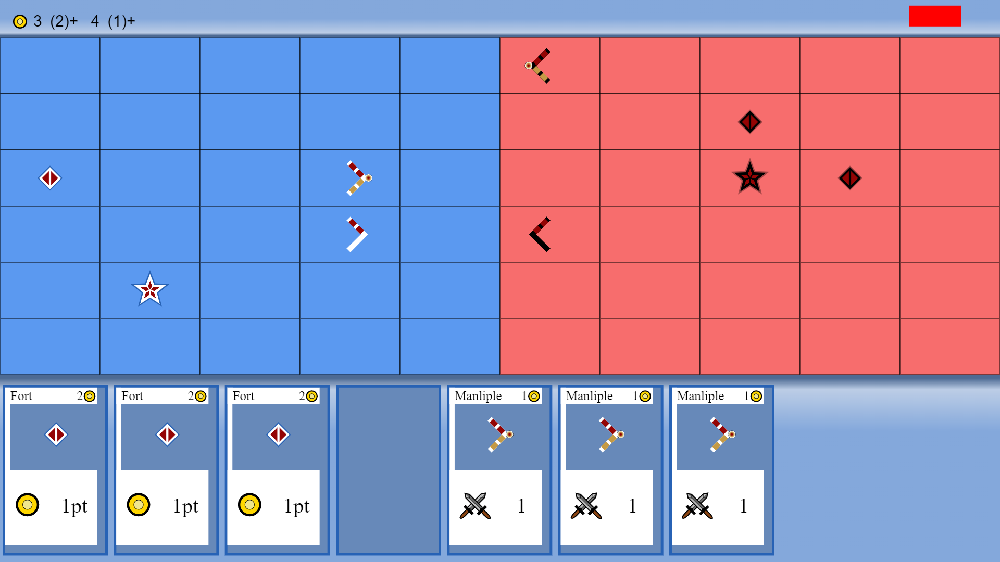

 
# Card City
## Description
The goal for the project is to create a turn based 4x strategy card game, however i dont plan on having an exploration aspect, so it will be more of a 3x game. I would like for the player to be able to: place buildings via cards, to earn a variety of recources, as well as specific cards from said buildings, place units using cards, move units already on the field, and acheive at least three diffrent types of victory conditions.

update v 0.0.1: 

you can now place cards on the board, buildings add to ticking resources at the top of the screen, and appear on the board, although there is only two at the moment. One a settlement, the yellow tile above, is randomly selected at the start of the game, and the other forts, which currently are in blue, can be places using the fort card. You can also put down units and move them, right now you can only place down a maniple, seen above as the red tile. I also added a next turn button in the top right of the screen, it is also red for the moment.
## Table of Contents
- #### [Description](##-description)
- #### [Installation](##-Installation)
- #### [Usage Information](##-usage-information)
- #### [License](##-license)
- #### [Contributing](##-contributing)
- #### [Questions](##-questions)

## Installation
You can git clone it off gitHub, or hopefully I will be able to deploy it as a visitable website.
## Usage Information
I will have a tutorial section in game.
## License
Boost Software License - Version 1.0 - August 17th, 2003
 
 Permission is hereby granted, free of charge, to any person or organization
 obtaining a copy of the software and accompanying documentation covered by
 this license (the "Software") to use, reproduce, display, distribute,
 execute, and transmit the Software, and to prepare derivative works of the
 Software, and to permit third-parties to whom the Software is furnished to
 do so, all subject to the following:
 
 The copyright notices in the Software and this entire statement, including
 the above license grant, this restriction and the following disclaimer,
 must be included in all copies of the Software, in whole or in part, and
 all derivative works of the Software, unless such copies or derivative
 works are solely in the form of machine-executable object code generated by
 a source language processor.
 
 THE SOFTWARE IS PROVIDED "AS IS", WITHOUT WARRANTY OF ANY KIND, EXPRESS OR
 IMPLIED, INCLUDING BUT NOT LIMITED TO THE WARRANTIES OF MERCHANTABILITY,
 FITNESS FOR A PARTICULAR PURPOSE, TITLE AND NON-INFRINGEMENT. IN NO EVENT
 SHALL THE COPYRIGHT HOLDERS OR ANYONE DISTRIBUTING THE SOFTWARE BE LIABLE
 FOR ANY DAMAGES OR OTHER LIABILITY, WHETHER IN CONTRACT, TORT OR OTHERWISE,
 ARISING FROM, OUT OF OR IN CONNECTION WITH THE SOFTWARE OR THE USE OR OTHER
 DEALINGS IN THE SOFTWARE.
## Contributing
If you have any improvements, and or suggestions please email me at the email provided in the questions section. I would love a good suggestion, or help coding. 

## Questions
If you have any questions regarding this project please feel free to reach out at 

-Email: kylec0217@gmail.com 
-GitHub Username: krestle80 
